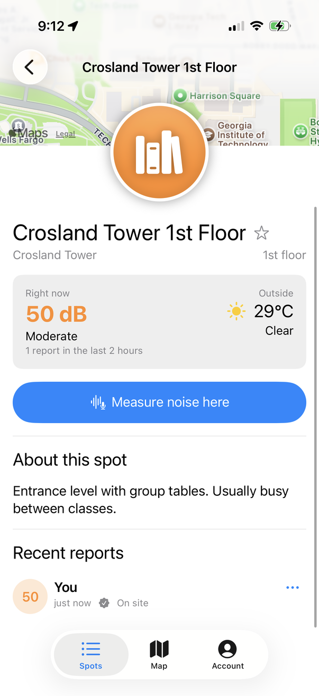
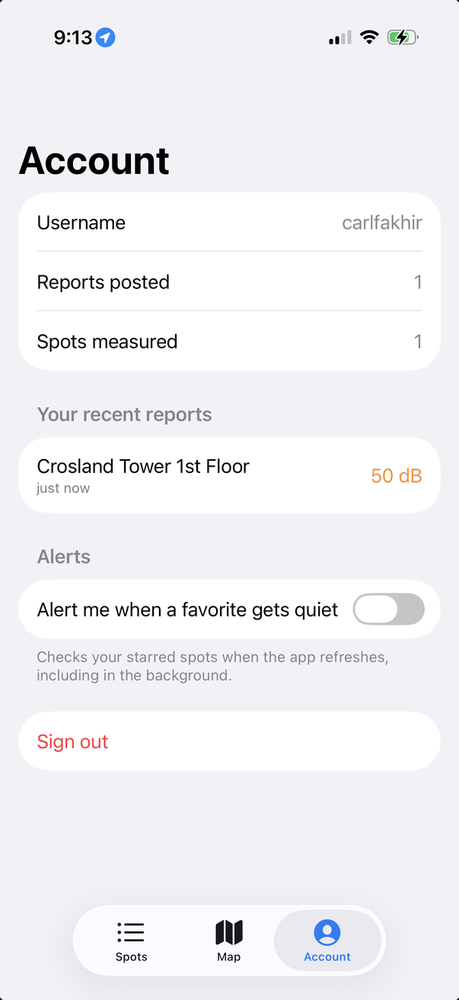

# Assignment 1 Submission — Quiet Spots

> **Draft.** Remaining: ✏️ partner section (after the swap).

## Name
Carl Fakhir (GT username `cfakhir3`)

## What I built
**Quiet Spots** is an iPhone app for finding a quiet place to study at Georgia Tech.

- Browse 12 campus study spots, sorted quietest first, with a favorites filter
- Measure how loud a spot is: the phone's microphone listens for 5 seconds and converts the level to approximate decibels
  (nothing is recorded), then you can vote quiet / okay / busy and add a note
- The app checks your GPS location and marks reports taken on site
- Everyone's reports appear on each spot's page, averaged over the last 2 hours into Quiet / Moderate / Loud
- Accounts: sign up / sign in, required to post; you can delete your own reports
- Current weather at each spot (Open-Meteo)
- Campus map with pins colored by noise level
- Notifications when a starred spot turns quiet, including checks during background app refresh
- Spanish translation of the whole UI and permission prompts
- A web dashboard (a second client on the same API) showing live levels and usage stats
- Usage analytics: app opens, screens viewed, reports posted, alerts delivered

It began as Apple's SwiftUI **Landmarks** sample ("Handling User Input") and was changed in stages, so the git history
shows a real sample app being built on and modified: national parks → study spots, bundled JSON → REST API,
favorite button → quiet alerts.

### Background
I had experience with programming, backends, and Git before this project, but less experience with Swift and iOS development.

### Why I chose this and what I hoped to learn
I wanted to build something original rather than just run a sample. I chose Quiet Spots because it addresses a practical campus problem: helping Georgia Tech students find quieter places
to study using shared noise reports. I wanted to explore how an iPhone app could combine microphone readings, location,
and a backend, and since I was newer to Swift and iOS, it was a way to learn the platform while building on backend and
Git skills I already had.

### What I learned
- How an iOS interface, device features (microphone, GPS, maps, notifications), and a backend fit together into one product.
- Real devices add steps a simulator hides: code signing, Developer Mode, trusting the developer profile, permission prompts.

## Requirement checklist

| # | Requirement | Evidence |
|---|---|---|
| 1 | Install a dev environment | Xcode 27 + iOS 27 SDK, Simulator, free Personal Team signing. [Journal: Xcode](dev-journal.md#xcode) · [HelloDevice on my iPhone](screenshots/01-HelloDevice-on-iPhone.png) |
| 2 | Build an existing sample on a device, with user input | Apple Landmarks sample committed unmodified (`01543ca`), built from that exact commit and run on my iPhone 17 Pro: [screenshot](screenshots/02-landmarks-sample-on-iphone.png). User input: favorite button and "Favorites only" toggle. |
| 3 | Git account, check in code, track tasks/bugs | [github.com/carlfakhir/quiet-spots](https://github.com/carlfakhir/quiet-spots) (public), 20+ commits, [Issues](https://github.com/carlfakhir/quiet-spots/issues) with labels, [dev journal](dev-journal.md) |
| 4 | Partner swap both ways | ✏️ _Partner's PR to my repo + my PR to theirs (links, screenshots)._ |
| 5 | Deployed web service with REST API, in git | [quiet-spots-api.cfakhir3.workers.dev](https://quiet-spots-api.cfakhir3.workers.dev/api), code in [`backend/`](../backend/), smoke test passes in production |

| Exceptional item | Evidence |
|---|---|
| Authentication | PBKDF2-hashed passwords, JWT bearer tokens, Keychain storage, owner-only delete |
| Third-party data | Open-Meteo weather on spot pages and saved with each report |
| Sensor / native feature | Microphone (AVFoundation), GPS (CoreLocation), MapKit, background refresh |
| User content shown to others | Noise reports, votes, and notes visible to everyone |
| UI experiments | Tab navigation (list / map / account), sign-in sheet that continues into measuring, Spanish localization |
| Another platform on the same backend | Web dashboard at `/` |
| Notifications | Local notifications + background app refresh, with a comparison to APNs / Firebase push in the journal |
| Activity data collection | `POST /events` from the app, summarized at `/stats` and on the dashboard |
| Testing | API smoke test script; XCUITest suite (sign up → measure → post; map → alerts) |

## Screenshots

| | |
|---|---|
|  | **First app on my iPhone.** Tiny SwiftUI app to prove signing and install worked end to end. |
|  | **Required sample app, unmodified, running on my iPhone.** Apple's Landmarks (Handling User Input), built from commit `01543ca` before any changes. |
|  | **Stage 1.** Landmarks list turned into GT study spots, with category badges replacing park photos. |
|  | **Stage 2.** Live noise levels from the REST API, sorted quietest first. |
|  | **Stage 3.** Spot page with weather → measuring → result with vote and location check → report posted. Captured by the automated UI test. |
|  | **Stage 4.** Campus map, alert settings, and a quiet-spot notification. |
|  | **Stage 5.** The app in Spanish. |
|  | **Web dashboard** on the deployed API with usage stats. |
|  | **Quiet Spots on my iPhone.** Spot list loaded from the live API (production had no reports yet). |
|  | **Spot page on the device** with live Open-Meteo weather (29 °C, clear) and the Measure button. |
|  | **Protected action.** Tapping Measure while signed out opens sign-in first, since posting requires an account. |
|  | **Campus map on the device** with a pin per study spot and the noise legend. |
|  | **Account tab** with sign in / create account. |
|  | **Real measurement on my iPhone.** I measured Crosland Tower 1st Floor at 50 dB (Moderate). The report shows the "On site" badge because GPS confirmed I was at the spot, and the page shows live weather. |
|  | **My account on the device** after posting, loaded from `GET /me` on the live API. |

## References
The annotated reference list is on its own page: [`docs/REFERENCES.md`](REFERENCES.md).

## Problems I had to debug
Details and fixes for each are in the [dev journal](dev-journal.md).

| Problem | What was going on | Fix |
|---|---|---|
| `xcodebuild` refused to run | Xcode license not accepted | `sudo xcodebuild -license accept` |
| Command-line signing: "login details were rejected" | `xcodebuild` couldn't reuse the Xcode account session | Opened Xcode's account settings, retried |
| App wouldn't launch on iPhone | Developer profile not trusted on the device | Settings → VPN & Device Management → Trust |
| `git push` HTTP 400 | ~5 MB of sample images over the default HTTPS buffer | `git config http.postBuffer` |
| API test "passed" when it shouldn't | Bash brace expansion split JSON into two bad requests | Build JSON in variables; stricter `expect()` |
| `'Tab' is only available in iOS 18` | Sample targeted iOS 17 | Raised deployment target |
| `wrangler login` timed out twice | OAuth page waits ~2 minutes | Re-ran while at the browser |
| Deploy: "register a workers.dev subdomain" | Interactive prompt in a non-interactive shell | Registered via Cloudflare API |
| TLS handshake failure on new URL | Certificate still being issued | Waited |
| Local "no such table: users" | Local DB keyed by database id changed | Re-ran local migrations |
| UI test typed 1 of 11 password characters | iOS strong-password suggestion ate keystrokes | Skip content type under `-uiTesting` |
| UI test couldn't find banner that was visible | Wrong element type in the query; found by watching the test's screen recording | Query any element type |
| Mixed-up commit | `git add -A` swept in unfinished files | Split with `git reset --soft`, force-push before anyone cloned |

## Repository and API
- **Repo:** https://github.com/carlfakhir/quiet-spots (public, so anyone in the class can access it).
  Started on GT GitHub (github.gatech.edu/cfakhir3/quiet-spots) and moved on Sept 15 so my partner could be added; see the [dev journal](dev-journal.md#moving-the-repo-to-my-personal-github).
- **API:** https://quiet-spots-api.cfakhir3.workers.dev (endpoints: [`/api`](https://quiet-spots-api.cfakhir3.workers.dev/api), stats: [`/stats`](https://quiet-spots-api.cfakhir3.workers.dev/stats))
- **Dashboard:** https://quiet-spots-api.cfakhir3.workers.dev/
- **Download and run:** see the [README](../README.md#run-the-ios-app): clone, open `ios/QuietSpots.xcodeproj`, pick your team and iPhone, ⌘R.
  Backend: `cd backend && npm install && npm run db:migrate:local && npm run dev`.

## Git history

```
5b1df7f  Sep 14 18:21  Add CheckIn backend API (Workers + Hono + D1) and project docs
ef2ad2b  Sep 14 19:07  Add dev journal for Xcode and GitHub setup
7fd5acb  Sep 14 19:10  Log simulator install, Apple ID team, and iPhone pairing
d45f870  Sep 14 19:38  Log first successful build and launch on iPhone
c5f77e6  Sep 14 19:39  Add screenshot of test app running on iPhone
01543ca  Sep 14 20:02  Add Apple's SwiftUI Landmarks sample (Handling User Input), unmodified
e2013cf  Sep 14 20:07  Reshape backend for Quiet Spots: study spots, noise reports, web dashboard
5876b2b  Sep 14 20:11  Turn Landmarks sample into Quiet Spots with Georgia Tech study spots
301144b  Sep 14 20:14  Load spots from the REST API and add sign in / create account
d6752c6  Sep 14 20:40  Deploy API to Cloudflare Workers
d609dac  Sep 14 20:53  Measure noise with the microphone and post reports
c81b807  Sep 14 20:56  Add campus map tab and quiet-spot alerts
0f3ecfd  Sep 14 20:58  Add Spanish localization
d89aae0  Sep 14 20:59  Show usage analytics on the web dashboard
85a669c  Sep 14 21:02  Run unmodified Landmarks sample on iPhone and draft submission
f7d950d  Sep 14 21:05  Add screenshots of Quiet Spots running on iPhone
2b010e8  Sep 14 21:05  Update git history in submission draft
ec563d7  Sep 14 21:05  Fix commit count in submission draft
e45a186  Sep 14 21:07  Separate references actually used from framework documentation
509b6fe  Sep 14 21:09  Add background, motivation, takeaways, and reflection to submission
8b40439  Sep 14 21:17  Add screenshots of a real noise report posted from iPhone
ba7bd42  Sep 15 17:12  Move repo to personal GitHub and update links and commit hashes
```
✏️ _Update with `git log --oneline` after the partner swap, and add a screenshot of the network graph or the merged PRs._

Evidence of git practice: renaming with `git mv` so history follows files from the Apple sample, one commit per stage,
a history rewrite that was fixed before anyone cloned, and Issues closed with commit references.

### Working with my partner ✏️
_(Fill in after tomorrow.)_
- **Who and how we met / communicated:** _(Chatter? In person? Text?)_
- **Plan:** _(e.g. each added the other as a collaborator; partner adds a study spot or changes a label in my app via a pull request;
  I do a similar change in theirs.)_
- **What they changed in my repo:** _(PR link, what it did, screenshot of it running on my phone after I pulled)_
- **What I changed in theirs:** _(PR link, what it did, how I built and tested it)_
- **Problems we debugged together:** _(e.g. signing team / bundle ID conflicts when building someone else's Xcode project,
  merge conflicts in `project.pbxproj`)_
- **What I learned about working with others:**
- **What I'd do differently next time:**
