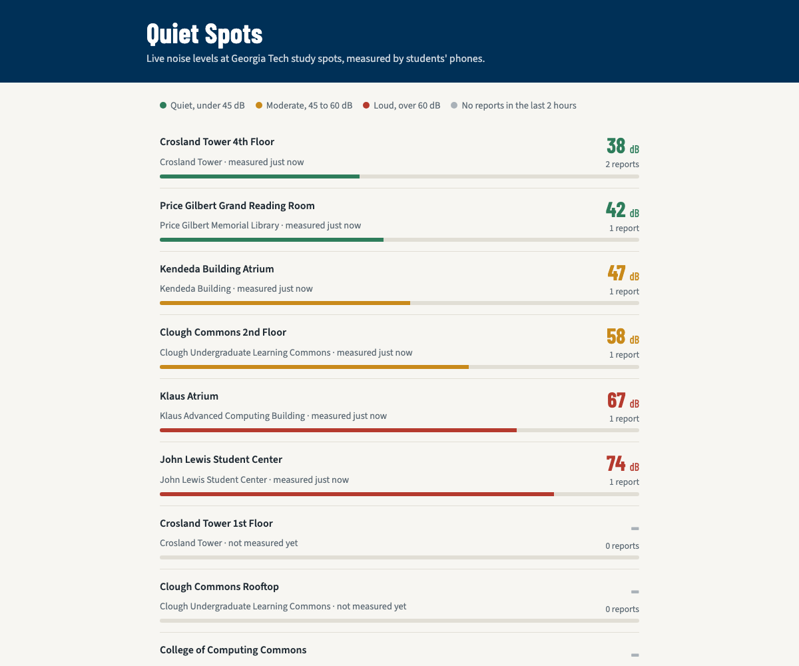
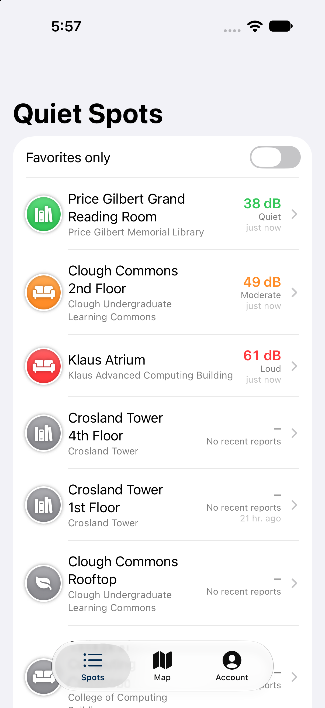

# Development journal

A running log of setup steps, problems hit, and how they were solved, for the write-up.

## 2026-09-14 — Environment + backend

**Machine:** MacBook (Apple M1, 16 GB), macOS 26.6.2

### Backend
- Chose Cloudflare Workers + Hono + D1: free and always on (Render's free tier sleeps and loses its disk; Firebase Functions needs a paid plan).
- `wrangler dev` + `scripts/smoke.sh` pass locally, including a live Open-Meteo weather lookup.

### Git / GitHub
- Already logged into both github.com (`carlfakhir`) and github.gatech.edu (`cfakhir3`) via `gh`.
- **Problem:** global git identity was a personal alias/email, so commits would not link to my GT account.
  **Fix:** set a repo-local identity (`git config user.name/user.email`) to `cfakhir3@gatech.edu`, leaving other projects untouched.
- **Problem:** `gh repo create --internal` failed: *"internal repositories can only be created within an organization"*.
  **Fix:** created it as `--public`. On GT Enterprise GitHub that still requires a GT login to view.
- Created labels (`assignment-core`, `exceptional`, `partner`) and Issues #1–#8 as a task board.

### Xcode
- Only Command Line Tools were installed (`xcodebuild` errored: *"requires Xcode, but active developer directory is a command line tools instance"*).
- Installed **Xcode 27.0 (27A266a)** from the Mac App Store.
- **Problem:** `xcodebuild` then refused to run: *"You have not agreed to the Xcode license agreements"*.
  **Fix** (needs admin password, so run in Terminal):
  ```bash
  sudo xcode-select -s /Applications/Xcode.app/Contents/Developer
  sudo xcodebuild -license accept
  sudo xcodebuild -runFirstLaunch
  ```
- Verified: `xcode-select -p` → Xcode, iOS 27.0 device SDK present.
- Installed iOS 27.0 Simulator runtime (`xcodebuild -downloadPlatform iOS`, 8.05 GB) for SwiftUI previews.
- Added Apple ID in Xcode → Settings → Accounts → free **Personal Team** (apps signed this way expire after 7 days).

### iPhone
- Device: iPhone 17 Pro, iOS 26.6.2, paired over USB (`xcrun devicectl list devices`).
- **Problem:** device showed `connected (no DDI)`; `devicectl device info details` reported
  *"The operation failed because Developer Mode is turned off."* The Developer Disk Image can't mount until it's on.
  **Fix:** Settings → Privacy & Security → Developer Mode → On → restart → confirm.

### First app on the iPhone (end-to-end toolchain check)
- Generated a tiny SwiftUI "HelloDevice" app (button + tap counter) with [XcodeGen](https://github.com/yonaskolb/XcodeGen)
  (`brew install xcodegen`) so the project can be described in a text file instead of a binary `.xcodeproj`.
- **Problem:** first `xcodebuild -allowProvisioningUpdates` failed:
  *"Unable to log in with account … The login details … were rejected"* and *"No profiles for 'edu.gatech.cfakhir3.HelloDevice' were found"*.
  **Fix:** opened the project in Xcode and checked Settings → Apple Accounts (account was fine). Retrying the
  command-line build then succeeded. Xcode app refreshed the account session / signing certificate that `xcodebuild` reuses.
- Installed with `xcrun devicectl device install app`.
- **Problem:** launch failed: *"invalid code signature, inadequate entitlements or its profile has not been explicitly trusted by the user"*.
  **Fix:** on the iPhone, Settings → General → VPN & Device Management → trust the developer Apple ID. Launch then worked,
  and the device state changed from `connected (no DDI)` to `connected`.
- Screenshot: [HelloDevice running on iPhone](screenshots/01-HelloDevice-on-iPhone.png), captured with `xcrun devicectl device capture screenshot`.
- **Learned:** with a free Personal Team, signing works but each new developer must be trusted on the device and apps expire after 7 days.

## 2026-09-14 (evening) — Pivot to Quiet Spots

**Decision:** instead of a generic check-in app, build something original on top of a real sample:
*Quiet Spots*, a crowdsourced map of how loud Georgia Tech study spots are, measured with the phone microphone.
Starting point is Apple's SwiftUI **Landmarks** sample ("Handling User Input" chapter), because it already has
a list of places, a detail page with a map, a favorite button, and a filter toggle.

- Renamed the repo `checkin` → `quiet-spots` (`gh repo rename`); GitHub redirects the old URL.
- Commits are attributed only to my GT account (`cfakhir3`), verified via the GitHub API.

### Sample app committed unmodified
- Downloaded `HandlingUserInput.zip` from the Apple tutorial page (found the link by opening the page with Playwright,
  since the "Project files" button is rendered by JavaScript).
- **Problem:** `git push` failed: *"RPC failed; HTTP 400 … the remote end hung up unexpectedly"* (≈5 MB of images).
  **Fix:** `git config http.postBuffer 157286400`, then the push succeeded.
- Built for iOS with my team passed on the command line (`DEVELOPMENT_TEAM=HW9CPN28W6`) so Apple's files stay untouched.
  First attempt failed because the phone was locked/disconnected (`devicectl` showed `unavailable`), so built for
  `generic/platform=iOS` instead.

### Backend reshaped for spots + noise reports
- Migration `0002_quiet_spots.sql` drops check-ins and adds `spots` (12 GT study spots, approximate coordinates)
  and `reports` (dB level, quiet/ok/busy vote, note, distance from spot, weather at that time).
- `GET /spots` computes each spot's average level over the last 2 hours → `quiet` (<45 dB), `moderate`, `loud` (>60 dB).
- `GET /` serves a small **web dashboard**, a second client that reads the same API as the iPhone app.
- **Bug in my own test script:** the "duplicate username returns 409" check passed while the API actually returned 400.
  `bash -x` showed the JSON `{"username":…,"password":…}` inside `"$(…)"` was split by **bash brace expansion**
  into two broken requests, and `expect 400 400 409` compared the wrong arguments. The API was fine; the test was lying.
  **Fix:** build JSON in variables first, and make `expect()` fail if it doesn't get exactly 2 arguments.
- **Dashboard bug** found by screenshotting with Playwright: text read "last measured never measured". Fixed the copy.
- Local smoke test: all checks pass. 
- **Blocked:** `wrangler login` timed out waiting for browser authorization. Deploy is waiting on that.

## iOS Stage 1 — Landmarks → Quiet Spots (local data)
- Renamed the sample's files with `git mv` so history shows each Apple file becoming its Quiet Spots version
  (`Landmark.swift` → `Spot.swift`, `LandmarkList` → `SpotList`, `CircleImage` → `CategoryBadge`, …).
- Replaced the 12 national parks with 12 GT study spots (generated `spotData.json` from the backend's SQL seed so both match).
- Removed the park photos; each spot shows an SF Symbol badge for its category instead.
- Favorites moved out of the JSON into `UserDefaults`, because spot data will soon come from the server.
- Map zoom changed from 0.2° (a whole national park) to 0.004° (a single building).
- **Switched from Apple's `.xcodeproj` to [XcodeGen](https://github.com/yonaskolb/XcodeGen) (`ios/project.yml`).**
  Adding many new Swift files to a hand-maintained `project.pbxproj` is error-prone; XcodeGen regenerates it from a short YAML file.
  The generated project is still committed so anyone can open it in Xcode without installing XcodeGen.
- Accent color set to GT Navy (Tech Gold in dark mode).
- Built and ran in the iOS 27 Simulator. 

## iOS Stage 2 — REST API + accounts
- `APIClient` (async/await `URLSession`) with snake_case ↔ camelCase JSON conversion and readable server errors.
- Spots refresh from `GET /spots` on launch and with pull-to-refresh; the bundled JSON stays as an offline fallback.
  List is now sorted quietest first with a colored badge and dB reading.
- `AuthStore` + `SignInView`: sign in / create account against `/auth/login` and `/auth/register`.
  The token is stored in the **Keychain** (not UserDefaults) and sent as `Authorization: Bearer …`. A 401 signs the user out.
- `AccountView` shows `/me`: report count, spots measured, recent reports.
- The Simulator uses `http://localhost:8787` (the Mac's `wrangler dev`); a physical iPhone uses the deployed URL.
  Needed `NSAllowsLocalNetworking` in `Info.plist` for plain HTTP to localhost.
- **Problem:** build failed: *"'Tab' is only available in iOS 18.0 or newer"*. Apple's sample targeted iOS 17.
  **Fix:** raised the deployment target to iOS 18 (my phone runs iOS 26).
- 

## Backend deployed to Cloudflare
**Live API:** https://quiet-spots-api.cfakhir3.workers.dev (dashboard at `/`, endpoint list at `/api`)

- **Problem:** `npx wrangler login` timed out twice (*"Timed out waiting for authorization code"*). The OAuth page
  only waits ~2 minutes for the "Allow" click. **Fix:** ran it again while I was at the browser.
- `wrangler d1 create quiet-spots-db` → put the `database_id` in `wrangler.toml`, `wrangler d1 migrations apply --remote`.
- JWT secret generated with `openssl rand -base64 48` and stored as a Worker secret (`wrangler secret put JWT_SECRET`), never in git.
- **Problem:** first `wrangler deploy` uploaded the code but failed: *"You need to register a workers.dev subdomain"*.
  Wrangler asks interactively, which didn't work from a non-interactive shell.
  **Fix:** registered the `cfakhir3` subdomain through the Cloudflare REST API
  (`PUT /accounts/{id}/workers/subdomain`) with the login token, then deployed again.
- **Problem:** the new URL resolved but HTTPS failed: *"TLS alert, handshake failure"*.
  **Cause:** the certificate for a brand-new workers.dev subdomain takes a few minutes to issue. Waited in a retry loop.
- **Problem:** after adding the real `database_id`, the *local* dev server started returning 500 *"no such table: users"*.
  **Cause:** Wrangler keys the local SQLite file by database id, so it created a fresh empty one.
  **Fix:** `npm run db:migrate:local` again.
- `bash scripts/smoke.sh https://quiet-spots-api.cfakhir3.workers.dev`: all checks pass in production, including live Open-Meteo weather.

## iOS Stage 3 — Measure noise, location, weather, shared reports
- `NoiseMeter` (AVFoundation): records to `/dev/null` with metering on, samples `averagePower` every 0.1 s for 5 s.
  The mic reports dBFS (0 = max, about −160 = silence), so I add a fixed +90 offset to get an approximate dB SPL.
  Readings are averaged in the power domain (`10·log10(mean(10^(dB/10)))`) because decibels are logarithmic.
- `LocationProvider` (CoreLocation): one-shot location; the app shows distance to the spot and the server stores it.
- Spot page now shows the live 2-hour average, **Open-Meteo weather**, and everyone's recent reports
  (you can delete your own). Tapping *Measure* while signed out opens sign-in first.
- Usage events (`screen_view`, `report_posted`, `report_deleted`) sent to `POST /events`.
- Added `NSMicrophoneUsageDescription` and `NSLocationWhenInUseUsageDescription` (the app crashes on first mic use without them).

### Automated UI test (XCUITest)
`QuietSpotsUITests` creates an account, opens a spot, measures, votes, posts, and checks the report appears.
Took four runs to get green, and each failure taught something:
1. **Failed:** *"Password must be at least 8 characters"* even though the test typed 11. The saved UI hierarchy showed only
   one character in the field: iOS's **strong password suggestion** (triggered by `.newPassword`) swallowed the keystrokes.
   **Fix:** the app skips `textContentType` when launched with `-uiTesting`.
   Same run: the local server returned *"no such table: users"* because adding the production `database_id` gave local dev a new empty DB.
2. **Failed:** couldn't find a text equal to the username. Sign-up actually worked; `LabeledContent` exposes one combined
   accessibility label ("Username, tester_1754"), and a **"Save Password?"** system prompt covered the screen.
   **Fix:** assert on the Sign out button and combined label, dismiss the prompt.
3. **Failed:** no "Create account" button. The Simulator was **still signed in** from run 2 because Keychain items survive app reinstalls.
   **Fix:** test signs out first if needed.
4. **Passed** (42 s). Screenshots below are attachments exported from the test result with `xcrun xcresulttool export attachments`.

The Simulator measured my Mac's microphone (46 dB, "Moderate") and the location check read 0 m because
I set the Simulator's location to the spot with `xcrun simctl location … set`.


- **Copy bug** spotted in the screenshots: "1 reports in the last 2 hours". Fixed with SwiftUI automatic grammar agreement
  (`^[\(n) report](inflect: true)`).

**Git mistake and fix:** my deploy commit used `git add -A` and accidentally swept in half-finished Stage 3 iOS files,
so its message didn't match its contents. Because no one had cloned the repo yet, I split it with
`git reset --soft HEAD~1`, re-committed the deploy files and the Stage 3 files separately, and pushed with `--force-with-lease`.
**Lesson:** stage specific paths (`git add backend/wrangler.toml …`) and check `git show --stat` before pushing.

## iOS Stage 4 — Map tab and quiet alerts
- **Map tab** (MapKit): every spot is a pin showing its dB, colored quiet/moderate/loud, with a legend and the user's location.
  Tapping a pin opens the same spot page.
- **Quiet alerts** (UserNotifications + BackgroundTasks): after each refresh, the app compares each starred spot's level to the
  last level it saw and posts a local notification when one turns *quiet*. It also registers a background app refresh task
  (`.backgroundTask(.appRefresh)`), so iOS can wake the app periodically to check while it's closed.
- Notifications show as banners even while the app is open (`UNUserNotificationCenterDelegate.willPresent`).
- A "Send a test alert" button makes the feature demoable without waiting for data to change.

**Local notifications vs. push (the comparison the assignment asks for):**

| | Local notification (what I built) | Remote push via APNs / Firebase Cloud Messaging |
|---|---|---|
| Who decides to alert | The app, after it fetches data | The server, when a report comes in |
| Works when app is closed | Only when iOS grants background refresh time (not guaranteed, often 15+ min apart) | Yes, delivered right away |
| Setup | Permission prompt + a few lines of code | Paid Apple Developer Program ($99/yr) for push capability, APNs key, server stores device tokens |
| Backend involvement | None | Server must track who starred what and send the push |

Firebase (listed in the course resources) wraps APNs with an easier API, but it still needs the APNs key from a paid account,
which a free Personal Team can't create. Local notifications were the realistic choice here, and the trade-off is timeliness.

- **Test failure:** the UI test couldn't find the banner even though it appeared. The **screen recording attached to the
  test result** showed "Crosland Tower 4th Floor is quiet now" on screen. The query searched only `otherElements`;
  SpringBoard exposes the banner as a different element type. **Fix:** search `descendants(matching: .any)`. Passed.
- Test alerts now say they're a test, so they don't claim a spot is quiet when it isn't.


## iOS Stage 5 — Spanish localization
- Built with `SWIFT_EMIT_LOC_STRINGS=YES` and read the compiler's `.stringsdata` output to get the **exact** 74 localizable keys
  (including interpolations like `You're %lld m from this spot`), instead of guessing them by hand.
- Added `Localizable.xcstrings` (String Catalog) with Spanish for every UI string, and `InfoPlist.xcstrings` so the
  **microphone and location permission prompts** are in Spanish too.
- Plurals use SwiftUI automatic grammar agreement, which also works in Spanish (`^[%lld reporte](inflect: true)`).
- Spot names and building names stay in English: they're proper names and come from the server.
- Tested by launching the Simulator app with `-AppleLanguages "(es)"`. 

## Running on the iPhone
- **Landmarks sample, unmodified:** since the repo had already moved on, I checked out the exact commit where Apple's sample was
  added into a temporary worktree (`git worktree add --detach … 01543ca`), built it with my team passed on the command line,
  and installed it with `xcrun devicectl device install app`. 
- **Quiet Spots** built for the device (talks to the live API instead of localhost) and installed alongside it.
- Screenshots taken on the phone of Quiet Spots running against the live API:
  [spot list](screenshots/11-device-spot-list.png) · [spot page with weather](screenshots/12-device-spot-detail-weather.png) ·
  [sign in to measure](screenshots/13-device-sign-in-to-measure.png) · [map](screenshots/14-device-map.png) · [account](screenshots/15-device-account.png).
  Weather on the device matched the API (29 °C, clear), which confirms the phone build uses the deployed backend, not localhost.
- **First real measurement from the iPhone:** Crosland Tower 1st Floor, 50 dB (Moderate), posted as `carlfakhir` with an
  "On site" badge (GPS within 150 m of the spot). [spot page](screenshots/16-device-report-posted.png) · [account](screenshots/17-device-account-with-report.png)

## Moving the repo to my personal GitHub
- **Problem:** my partner's account (`jmbgat`) is on github.com, but the repo was on GT GitHub (github.gatech.edu).
  Adding him failed with *"Not Found"*: GT GitHub is a separate server with its own accounts and can't see github.com users.
- **Options:** he signs in to GT GitHub once to create an account, or I move the repo. The assignment allows "your own GitHub
  repository as long as you can provide access to anyone in the class", so I moved it to a **public** repo on my personal account.
- **Before making it public** I searched the whole history for secrets (`git grep` over every commit for password/token/key
  patterns, and checked for `.env`/`.dev.vars` files). Nothing sensitive: the backend secret lives only in Cloudflare.
- **Commit author:** rewrote all commits from my GT email to my GitHub no-reply address with
  `git filter-repo --mailmap`, so they count on my personal profile without exposing an email. Dates and messages are unchanged
  (checked by diffing `git log --date=iso` before and after). A rewrite changes every commit hash, so I updated the hashes
  quoted in these docs.
- **Issues:** GitHub can't transfer Issues between servers, so #1–#10 were recreated in order (same numbers, labels, comments,
  open/closed state) with a note giving the original dates and commit references mapped to the new hashes.
- Kept the GT repo untouched as a backup and disabled pushing to it locally so the rewritten history can't be pushed there by accident.

## 2026-09-15 — Partner swap, part 1: my partner's change to my repo
- **Access:** invited my partner, Jad Mathew Bardawil (`jmbgat`), as a collaborator with write access after moving the repo (section above). He accepted, and he
  added me to his repo, `jmbgat/campusFinder`.
- **His repo was empty:** when I accepted his invite and cloned it, Git warned *"You appear to have cloned an empty repository"*
  and `git ls-remote` showed no branches. His code was still only on his machine, so my change to his app waits until he pushes.
- **His branch:** he pushed `feature/add-last-updated-timestamp` (commit `c4e8abd`), which puts a "last updated" time
  ("just now", "21 hr. ago") under each spot's noise level in `SpotRow.swift`, plus a one-line README edit.
- **Review before merging:**
  - The branch started from my latest `main`, and the diff touched only `SpotRow.swift` and `README.md`. His signing Team and
    bundle ID changes stayed local, which was the thing most likely to break my build.
  - Checked the data is real: the live `/spots` endpoint returns `last_report_at` (Crosland Tower 1st Floor had my report from
    Sept 14), and the app decodes snake_case into `lastReportAt`.
  - Built the branch for the Simulator and for my iPhone 17 Pro, installed it on the phone, and launched it.
- **No pull request at first:** he had pushed the branch without opening a PR. I asked him to open one so the review and
  merge would be recorded on GitHub instead of me merging the branch directly. He opened
  [PR #11](https://github.com/carlfakhir/quiet-spots/pull/11), and I approved and merged it (merge commit, so his commit keeps
  his name in the history).
- **After merging:** pulled `main`, rebuilt, and installed it on my iPhone again. For the screenshot I ran the Simulator against
  the local backend with a few test reports so several rows show a time. 
- **Evidence:** [PR with review and merge](screenshots/19-partner-pr11-review-merged.png) ·
  [files changed](screenshots/20-partner-pr11-files-changed.png) · [branch](screenshots/21-partner-branch.png) ·
  [git graph](screenshots/22-git-graph-partner-merge.png). GitHub's Network graph page only loads for signed-in users, so the
  git graph image was made from `git log --graph` instead.

